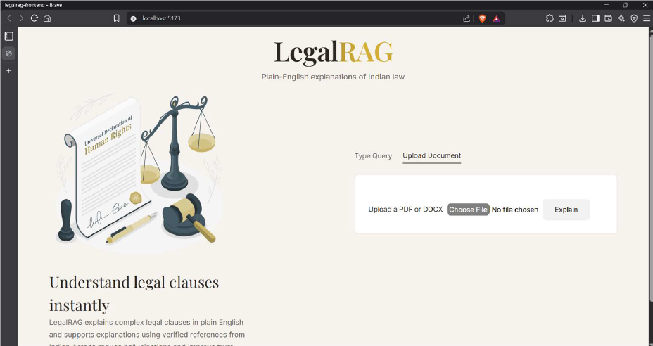
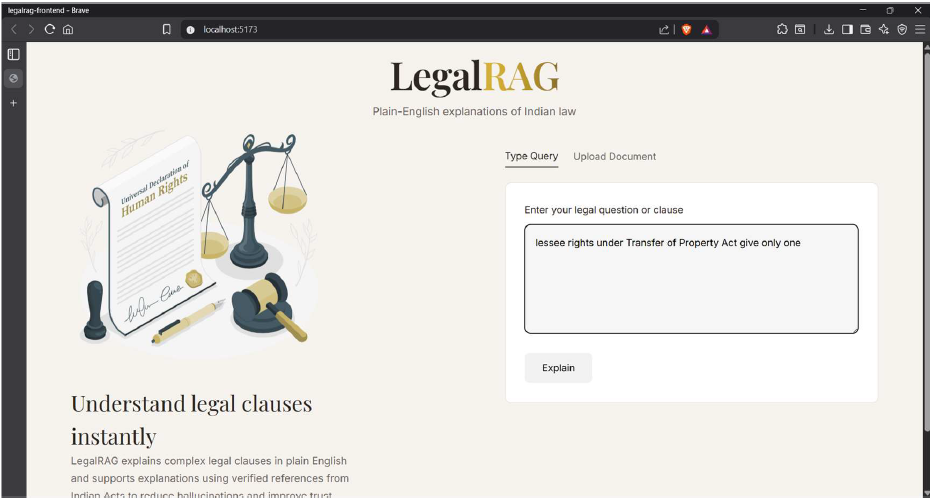
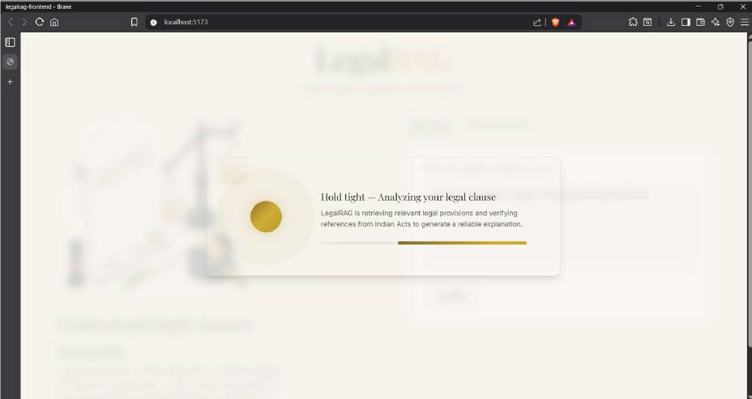
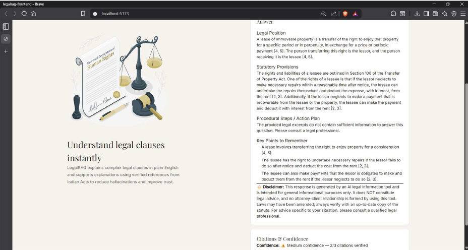
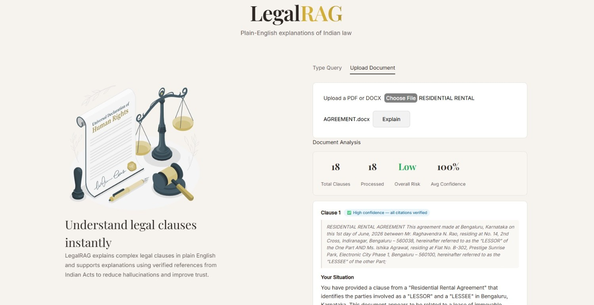

# ⚖️ LegalRAG

### AI-Powered Legal Document Analysis using Retrieval-Augmented Generation

An intelligent legal assistant that retrieves relevant provisions from Indian Acts and generates grounded, plain-English explanations for legal questions and legal documents.

<p align="center">
  
</p>


---

# 📖 Overview

LegalRAG is an AI-powered legal document analysis system that leverages **Retrieval-Augmented Generation (RAG)** to simplify legal research and improve document understanding.

Instead of relying solely on a Large Language Model, the system first retrieves relevant legal provisions from **IndiaCode** using **Semantic Search**, **BM25**, and **Reciprocal Rank Fusion (RRF)** before generating responses. A dedicated **Citation Verification** layer validates retrieved references and assigns confidence scores, improving response reliability while reducing hallucinations.

## 📑 Table of Contents

- Key Highlights
- Features
- System Architecture
- Technology Stack
- Core Components
- Workflow
- Application Preview
- Future Enhancements
- Disclaimer

# 🌟 Key Highlights

- AI-powered legal assistant focused on Indian law
- Clause-by-clause explanation of legal documents
- Hybrid Retrieval using Semantic Search + BM25 + RRF
- Grounded explanations powered by Google Gemini
- Citation verification with confidence scoring
- Hallucination detection
- React + Vite frontend with FastAPI backend

# ✨ Features

- AI-powered legal question answering
- Clause-by-clause legal document analysis
- PDF and DOCX support
- Retrieval-Augmented Generation (RAG)
- Hybrid retrieval using Semantic Search, BM25, and RRF
- Automatic clause segmentation
- Grounded response generation using Gemini 2.5 Flash
- Citation verification
- Confidence scoring
- Hallucination detection

# 🏛️ System Architecture

```text
User
 ↓
Document Processing & Clause Segmentation
 ↓
Gemini Embedding-001
 ↓
ChromaDB
 ↓
Semantic Search + BM25 + RRF
 ↓
Gemini 2.5 Flash
 ↓
Citation Verification
 ↓
Confidence Score
 ↓
Grounded Response
```

# 🚀 Technology Stack

| Category | Technologies |
|---|---|
| Frontend | React + Vite + Tailwind CSS |
| Backend | FastAPI |
| Language | Python 3.10 |
| Framework | LangChain |
| Knowledge Base | IndiaCode |
| Vector Database | ChromaDB |
| Embedding Model | Gemini Embedding-001 |
| LLM | Gemini 2.5 Flash |
| Retrieval | Semantic Search + BM25 + RRF |
| PDF Processing | pdfplumber |

# 🧩 Core Components

| Component | Description |
|---|---|
| Frontend | React + Vite application |
| Backend | FastAPI APIs |
| Document Processing | Clause extraction and segmentation |
| Retrieval | Semantic Search + BM25 + RRF |
| Knowledge Base | ChromaDB built from IndiaCode |
| LLM | Gemini-based explanation generation |
| Verification | Citation verification and confidence scoring |

# 🔄 Workflow

1. User submits a legal query or document.
2. Clauses are extracted and embedded.
3. ChromaDB retrieves relevant legal provisions.
4. Hybrid retrieval combines Semantic Search, BM25, and RRF.
5. Gemini generates a grounded explanation.
6. Citation verification validates the response.
7. Confidence score is displayed.

# 📸 Application Preview

## Home Page


## Legal Question Interface



## Retrieval & Analysis



## AI Generated Response



## Document Analysis



# 🚀 Future Enhancements

- Expand the knowledge base with case laws and amendments
- Support multilingual legal documents
- NLP-based clause segmentation
- OCR support for scanned documents
- PDF export
- Cloud deployment
- User authentication

# ⚠️ Disclaimer

This project is intended for educational and research purposes only and should not be considered a substitute for professional legal advice.

---

<div align="center">

**Developed using React, Vite, FastAPI, LangChain, ChromaDB, and Google Gemini**

</div>
